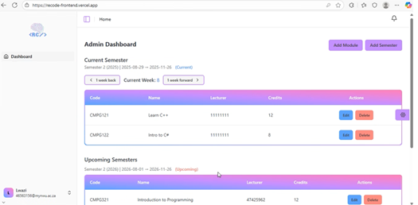
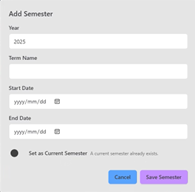
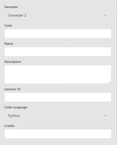

# Admin Dashboard Guide

This guide explains the Admin functionality in RECODE.

## Overview

Admins manage semesters, modules, course instances, and assign lecturers.  
- For navigation between different weeks use the **1 Week Back** or **1 Week Forward** buttons

## Create Semester

1. Navigate to **Admin Dashboard**  
2. Click **Add Semester**  
3. Enter:
   - Year
   - Term Name
   - Start and End dates 
   - Option the set as current semester
4. Click **Save Semester** to successfully create a semester
5. Click **Cancel** to revert creation of semester
6. Confirmation message appears

## Create Module

1. Navigate to **Admin Dashboard**  
2. Click **Add Module**  
3. Enter:
   - Module Code
   - Module Name  
   - Module Description
   - Lecturer ID
   - Code Language
   - Credits
4. Submit to have the Module added

---

[Back to User Guides](../index.md)  
[Return to Home](/)