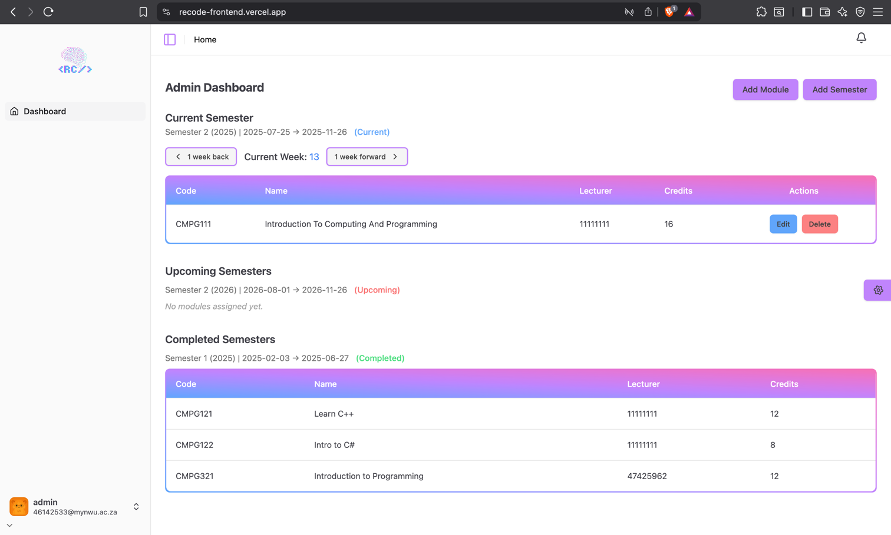
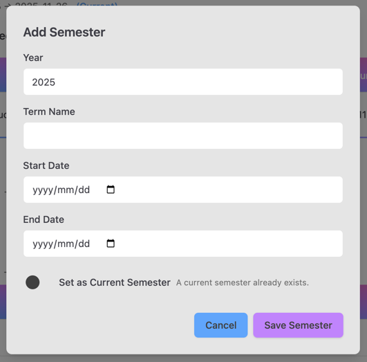
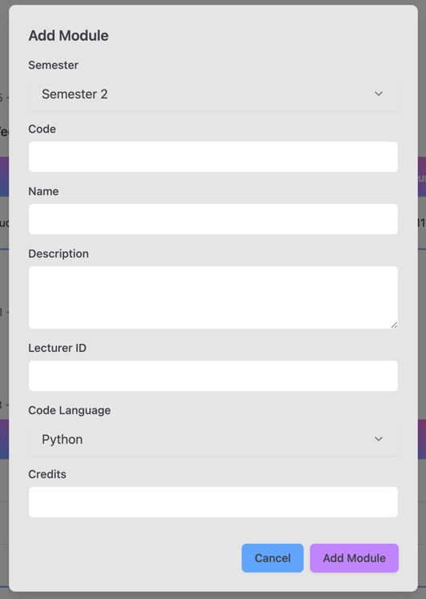

# Admin Dashboard Guide

This guide explains the Admin functionality in RECODE.

## Overview

Admins manage semesters, modules, course instances, and assign lecturers.  
- For navigation between different weeks use the **1-Week Back** or **1-Week Forward** buttons.
- Admins can see past, current and future semesters.
- Current and future semesters can be edited by adding, editing and deleting modules.
- Admins can add new semesters and modules.

## Create Semester

1. Navigate to **Dashboard**.
2. Click **Add Semester**.
3. Enter semester details.
4. Click **Save Semester** to successfully create a semester.
5. Click **Cancel** to revert the creation of the semester.
6. Confirmation message appears.

## Create Module

1. Navigate to **Dashboard**.
2. Click **Add Module**.
3. Enter module details.
4. Click **Add Module** to successfully create a module.
5. Click **Cancel** to revert the creation of the module.

