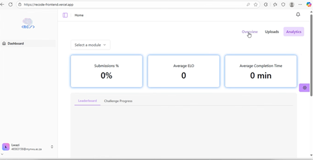

# Lecturer Analytics Dashboard

## Navigation
- [Overview Dashboard](./overview-dashboard)
- [Uploads Dashboard](./uploads-dashboard)
- [Modules](./modules)
- [Profile](./profile)
- [Back to Guides](../index.md)
- [Return to Home](../../index.md)

## Overview
Provides detailed analytics on student performance, average ELO, average completion time and challenge completion.

### Features
- Track student progress per module.
- View Submission rates.
- View ELO scores.
- View Average completion time.
- Analyze success rates by viewing the current student leaderboard and challenge progress board.

### Screenshots
