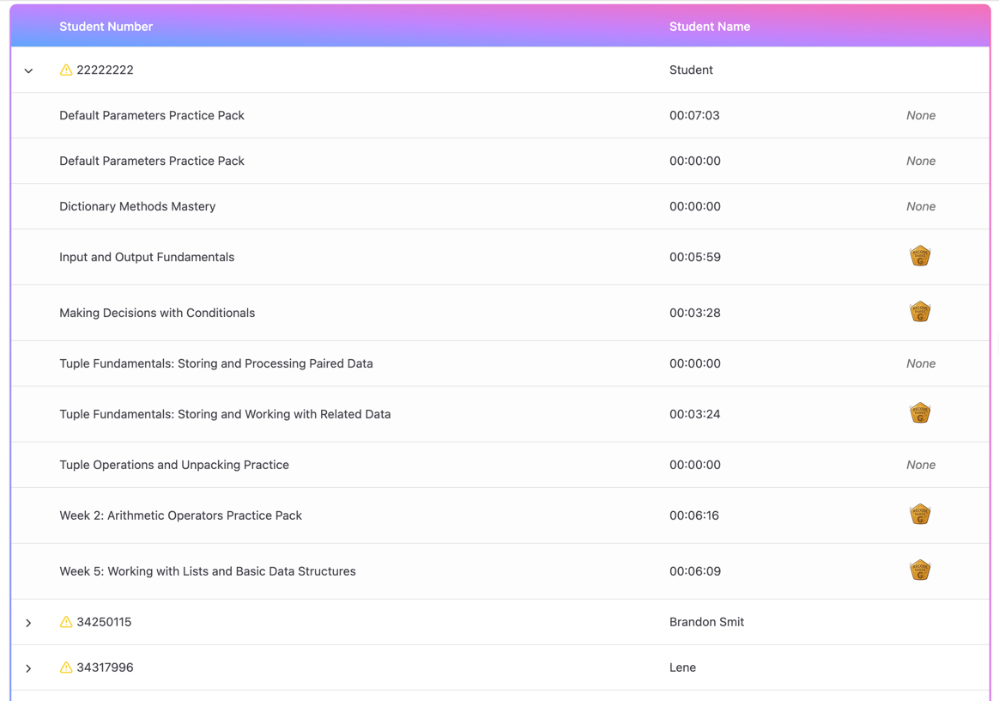

# Lecturer Analytics Dashboard

Provides detailed analytics on student performance.

## Features
- View statistics on student performance per module.
- View overview analysis such as submission percentage, average Elo, and average completion time.
- See the module leaderboard based on elo points in a graph.
- See the challenge attempts per challenge in a pie chart.
- Table view of all submissions.

## Table Details
- The table contains each student enrolled in the module along with their submission analytics.
- Expanding on a student will show the time spent and the highest badge earned per challenge.
- Students with a yellow warning icon before their student number is students at risk.

