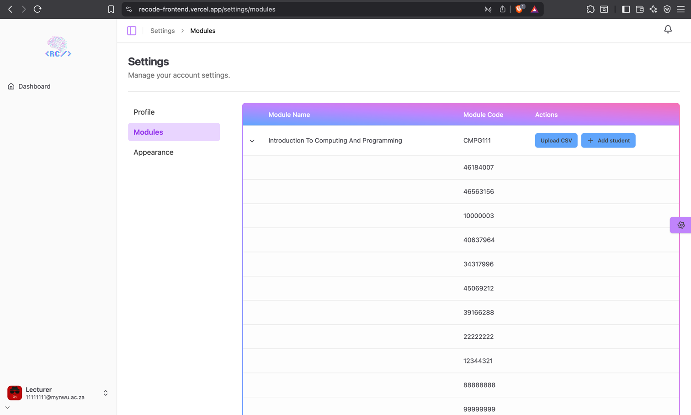

# Lecturer Modules

Manage modules the lecturer is assigned to.

## Accessing the page

- Go to your name in the bottom left of the navigation bar.
- Click on **Settings**.
- Go to the **Modules** tab.

## Features
- View modules the lecturer is assigned to.
- Enroll students in a module by either uploading a csv file of manually entering the student's student number.
- Expand a module to view all enrolled students in the module.

