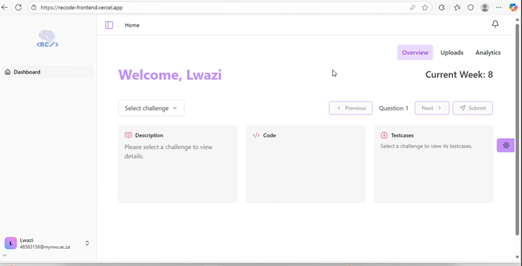

# Lecturer Overview Dashboard

## Navigation
- [Analytics Dashboard](./analytics-dashboard)
- [Uploads Dashboard](./uploads-dashboard)
- [Modules](./modules)
- [Profile](./profile)
- [Back to Guides](../index.md)
- [Return to Home](../../index.md)

## Overview
The Overview Dashboard provides a summary of the current week, published and draft challenge sets.

### Key Features
1. View **published** and **draft** challenge sets.
2. Enter code for challenges
3. Display test cases for selected challenge

### Challenge Selection
1. Lecturer navigates to overview.
2. Select a challenge from the drop down to display.
3. Description of challenge is given.
4. Challenge code is displayed.
5. Challenge testcases are displayed.

### Screenshots
