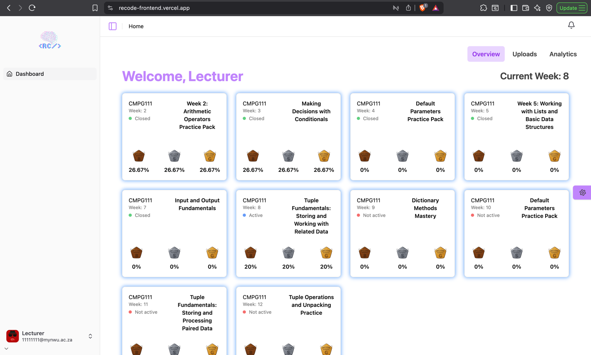
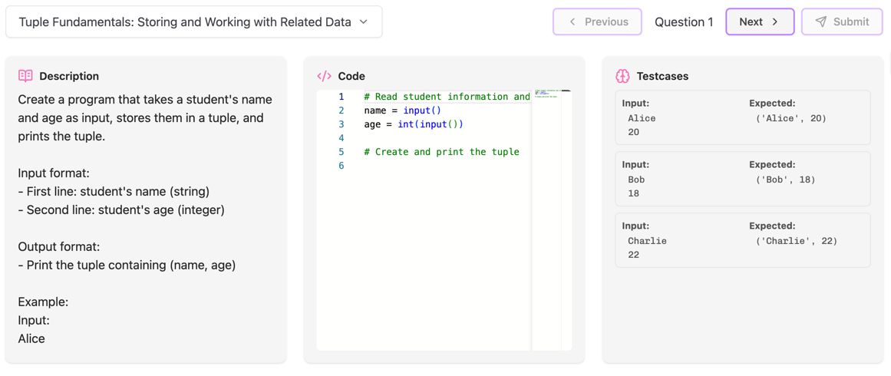

# Lecturer Overview Dashboard

The Overview Dashboard provides a summary of the current week, published and draft challenge sets.

## Key Features
- View **completed**, **active** and **not active** challenge completion rate.
- View coding questions for a selected challenge.
- View test cases for a selected challenge

## View Challenge Details
1. Navigate to the **Overview** tab.
2. Select a challenge from the drop-down at the bottom of the page.
3. View the question description, starter code and testcases.

### Screenshots
