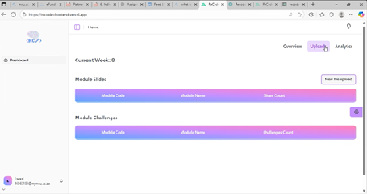
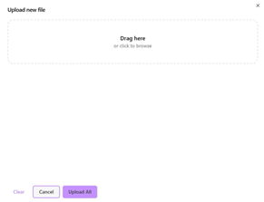

# Lecturer Guide: Upload & Publish Slides

Lecturers create interactive challenges from uploaded slides.

## Navigation
- [Overview Dashboard](./overview-dashboard)
- [Uploads Dashboard](./uploads-dashboard)
- [Modules](./modules)
- [Profile](./profile)
- [Back to Guides](../index.md)
- [Return to Home](../../index.md)

## Upload Slides

1. Navigate to **Lecturer Dashboard** then to **Uploads**  
2. Select  **New File Upload**  
3. Choose your PPT/PDF file by dragging from files or clicking to browse.
4. Click **Upload All** to upload slides or **Cancel** to cancel the action.
5. Slides are stored; extraction begins automatically

## AI Challenge Proposals

- Text is extracted from slides  
- NLP detects topics/subtopics  
- Claude generates challenge items (bronze, silver, gold, special)  

## View uploaded slides

1. Table displays module code, module name and amount of challenges created. 

## View extracted challenges

1. Table displayes module code, module name and amount of slides uploaded. 

