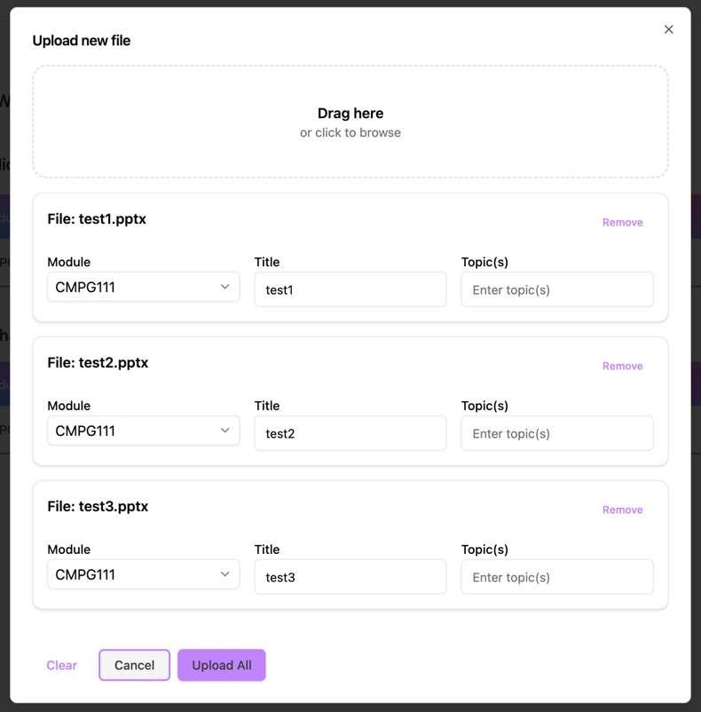
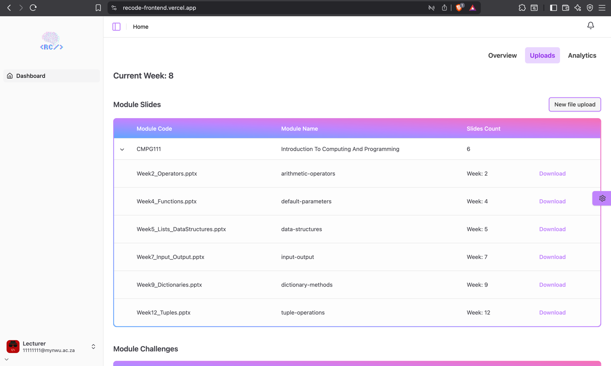

# Lecturer Guide: Upload & Publish Slides

Lecturers create interactive challenges from uploaded slides.

## Upload Slides

1. Navigate to **Dashboard** then to the **Uploads** tab.
2. Select **New File Upload**  
3. Choose your PPT/PDF file by dragging from files or clicking to browse.
4. Click **Upload All** to upload slides or **Cancel** to cancel the action.
5. Slides are stored; extraction begins automatically

::: info
Multiple slides can be uploaded at once.
Slides will be added to sequential weeks.
:::

## AI Challenge Proposals

- Text is extracted from slides  
- NLP detects topics/subtopics  
- Claude generates challenge items (bronze, silver, gold, special)  

## View uploaded slides

- Table displays uploaded slides grouped by modules.
- You can view slide details and download slides. 

## View extracted challenges

- Table displays generated challenges grouped by modules.
- You can view challenge details that was generated by the AI process. 

