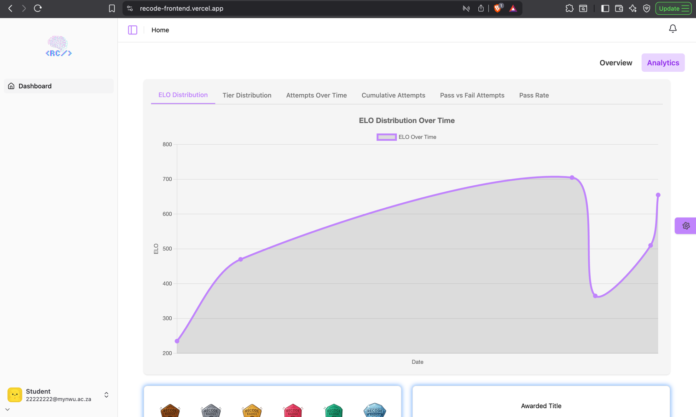
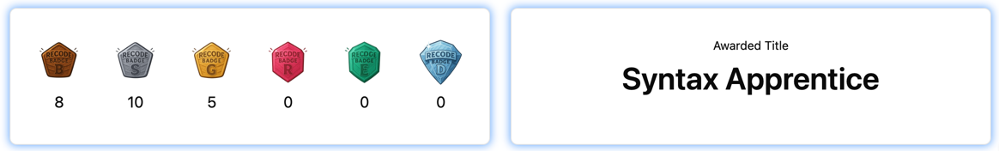
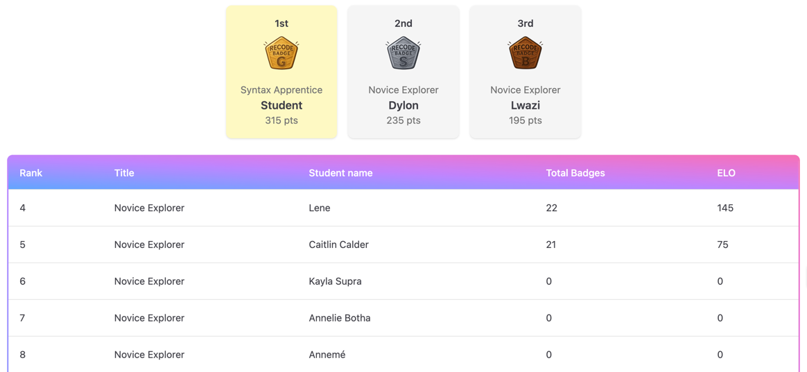

# Student Analytics Dashboard

View detailed statistics about challenge attempts, success rates, earned badges, leadership, and more.

## Performance Charts
The top section of the page contains interactive charts displayed under different tabs. 
Tabs allow switching between different types of analytics.

Available Tabs
| Column Name | Description |
| ------------ | ------------------------------------- |
| ELO Distribution | Student's ELO awarded over time |
| Tier Distribution | Quickly visualize the proportion of challenges attempted at each tier |
| Attempts Over Time | Shows progress/trends over time |
| Cumulative Attempts | See growth in difficulty tackled |
| Pass vs Fail Attempts | Shows a recent success/failure ratio |
| Pass Rate | Dashboard-style quick glance at overall success |

## Badges and Awarded Title
The middle section displays badge counts and the student’s awarded title.

Badges Display
- Each badge type has an icon and a count of badges earned.
- Badges get awarded to the student when they complete a challenge.

Awarded Title
- Shows the title currently awarded to the student (e.g., “Master Coder”).
- Displayed next to the badge summary in a separate card.

## Podium

The podium highlights the top 3 students in the leaderboard.

Podium Cards
- Displays student rank, title, name, ELO points, and icon.
- Gold, silver, and bronze icons are used for 1st, 2nd, and 3rd place respectively.
- Cards adjust height dynamically to align visually.

Layout Notes
- Only shown if there are at least 3 students in the leaderboard.
- Remaining students are listed in the leaderboard table below.

