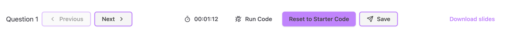
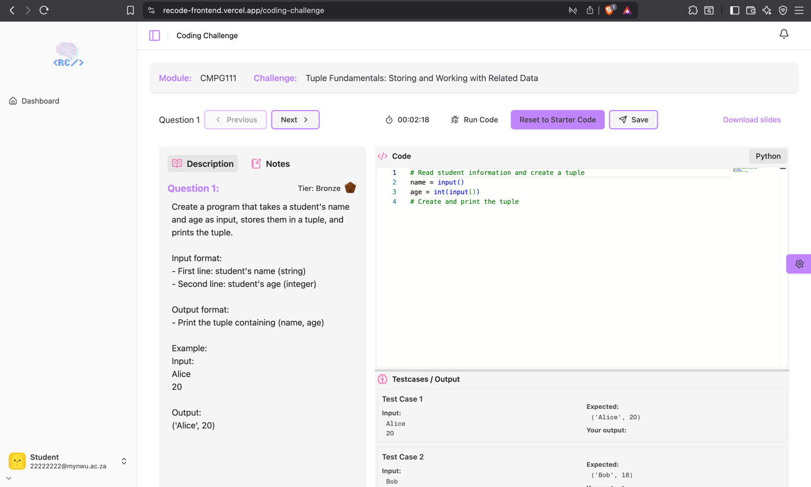

# Coding Challenges

Students interact with challenges, earn badges, and track progress.

## Access Weekly Challenges

1. Navigate to **Student Dashboard > Weekly Challenges**  
2. Click on either the **card** at the top of the page, or the **row** in the table of the challenge you want to attempt. 

## Top Button Bar

- Question: You can see the question number you are busy with and move between the question with the **Previous** and **Next** buttons.
- Timer: You can see the time you spent on the current question. The timer starts automatically when the question is displayed.
- Run Code: You can run the code to compare your code with the test cases and see the expected output vs your output and wether you passed or failed the test.
- Reset to Starter Code: This will reset the code to the original code or the last saved code.
- Save / Submit Challenge: Between the questions you can **Save** your code, this will save it and move you to the next question. You can **Submit** your code after you have finished all the questions.
- Download Slides: This will download the slides related to the challenge.

## Main View

- This view is split into three parts:
  - Description / Notes: The description of the challenge and what you need to do. The notes tab allows you to make notes.
  - Code section: Code editor with the starter code and where you can write your code.
  - Testcases / Output: The test cases that you need to pass and your output against the test cases.

## Submitting for Grading

1. Click **Submit Challenge** to submit all questions in the challenge. 
2. System computes verdict:
   - Badges, elo points, title gets updated based on your performance.
   - Wrong Answer: On the dashboard you will be able to see if you did not get a badge
