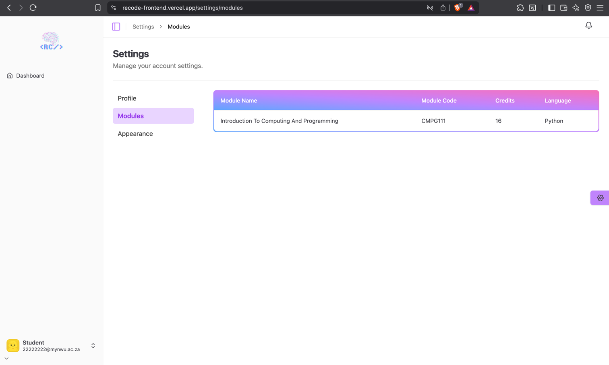

# Student Modules

Displays modules the student is enrolled in

## Accessing the page

- Go to your name in the bottom left of the navigation bar.
- Click on **Settings**.
- Go to the **Modules** tab.

## Features
- View modules the student is enrolled in. 
- This table shows details such as Module Name, Module Code, Credits, and Language coded in.

