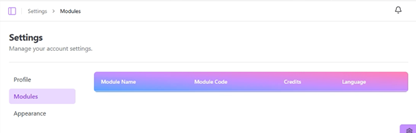

# Student Modules

## Navigation
- [Overview Dashboard](./overview-dashboard)
- [Analytics Dashboard](./analytics-dashboard)
- [Coding Challenge](./coding-challenge)
- [Profile Settings](./profile)
- [Back to Guides](../index.md)
- [Return to Home](../../index.md)

## Overview
Displays modules the student is enrolled in

### Features
- Access weekly challenge sets per module.
- View module details and timelines such as the credits and coding language.

### Screenshots
