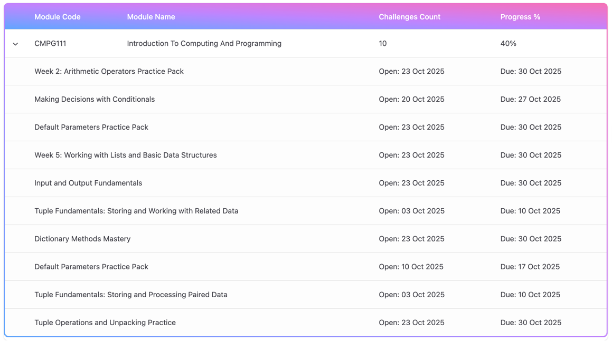

# Student Overview Dashboard

This is the starting point for coding challenges.

## Cards
- Displays weekly challenges, progress and results for the challenges in the current semester.
- Get info such as the name of the challenge, the progress of the challenge, the week of the challenge and the status.

## Table
- The table is located at the bottom of the page.
- Displaying information about the challenges per module.
- Progress bar displaying the progress of the module.
- Start and end dates of each challenge.

## Coding Challenge Steps
- Click on the challenge card to view the challenge.
- Click on the table row to view the challenge.
