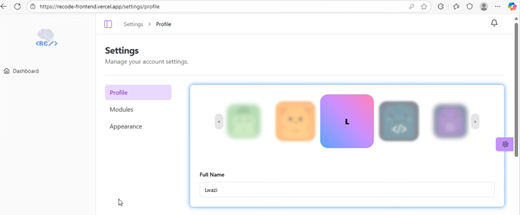

# Student Profile

## Navigation
- [Overview Dashboard](./overview-dashboard)
- [Analytics Dashboard](./analytics-dashboard)
- [Coding Challenge](./coding-challenge)
- [Modules](./modules)
- [Back to Guides](../index.md)
- [Return to Home](../../index.md)

## Overview
Manage student account information and settings.

### Features
- View and update personal details.
- Keep track of personal stats.

### Edit Personal Information
- Personlize your profile by selecting a picture and entering your full name.

1. Edit your Email by typing in the field provided.
2. Edit your Contact number by typing in the field provided.
3. Add or edit your Bio by typing in the field provided.
4. Click **Upload profile** to save your changes or **Reset Form** to revert changes.

